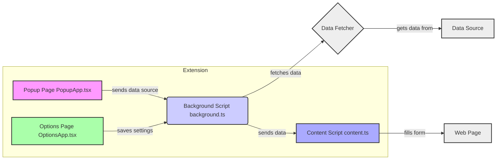

# Form Auto Filler Browser Extension

A powerful browser extension for automatic form filling with support for multiple data sources.

## Features

- Multiple data source support (External APIs, Local files)
- Secure data handling and storage
- Configurable form field mapping
- Real-time data synchronization
- User-friendly configuration interface

## Project Structure

```
/form-auto-filler
├── /src
│   ├── /chrome             # Chrome extension specific files
│   │   └── background.ts   # Background script
│   ├── /components         # Reusable React components
│   │   ├── /options        # Options page components
│   │   │   └── index.tsx, OptionsApp.tsx
│   │   └── /popup          # Popup page components
│   │       └── ActionPanel.tsx, DataPreview.tsx, DataSourceInput.tsx, index.tsx, PopupApp.tsx, StatusPanel.tsx
│   ├── /config             # Configuration files
│   │   └── default.ts
│   ├── /hooks              # Custom React hooks
│   │   └── useFormState.ts
│   ├── /lib                # Core functionality
│   │   └── dataFetcher.ts, formMapper.ts, storageManager.ts
│   ├── /services           # Services
│   │   └── messaging.ts
│   ├── /styles            # Global styles
│   │   └── content.css
│   ├── /test              # Test files
│   │   ├── /mocks         # Mock files
│   │   │   └── chrome.ts
│   │   └── setup.ts
│   ├── /types             # Type definitions
│   │   └── index.ts
│   │   └── types.ts       # Type definitions
│   ├── /utils             # Utility functions
│   │   └── dataTransform.ts, fieldDetection.ts
│   ├── content.ts         # Content script
│   └── types.ts           # Type definitions
├── /public               # Static assets
│   ├── options.html       # Options page HTML
│   └── popup.html         # Popup page HTML
│   └── /icons             # Extension icons
│       └── icon16.png, icon32.png, icon48.png, icon128.png
├── manifest.json        # Extension manifest
├── package.json         # Project dependencies
├── tsconfig.json        # TypeScript configuration
├── webpack.config.js    # Webpack configuration
└── jest.config.js       # Jest configuration
```

## 项目架构图



## Setup Instructions

1. Install dependencies:

   ```bash
   npm install
   ```

2. Build extension:

   ```bash
   npm run build
   ```

3. Load the extension in Chrome:
   - Open Chrome and navigate to `chrome://extensions/`
   - Enable "Developer mode"
   - Click "Load unpacked" and select the extension build directory (`/dist`)

## Configuration

The extension can be configured through the options page:

- Data source selection (API/Local file)
- API endpoint configuration
- Authentication settings
- Form field mapping rules

## Security

- All sensitive data is encrypted before storage
- Secure token management
- HTTPS/CORS validation
- Error handling and fallback mechanisms

## License

MIT License
