# Form Auto Filler - Architecture Diagrams

## System Architecture

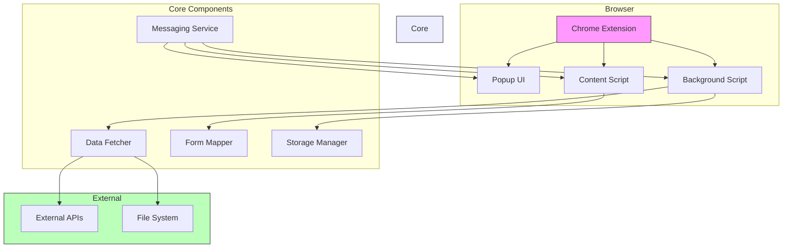

## Data Flow

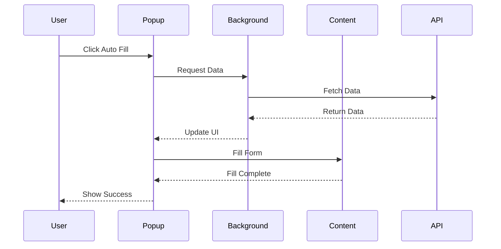

## Form Detection Process

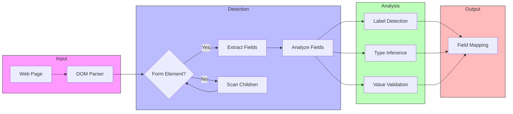

## Component Architecture

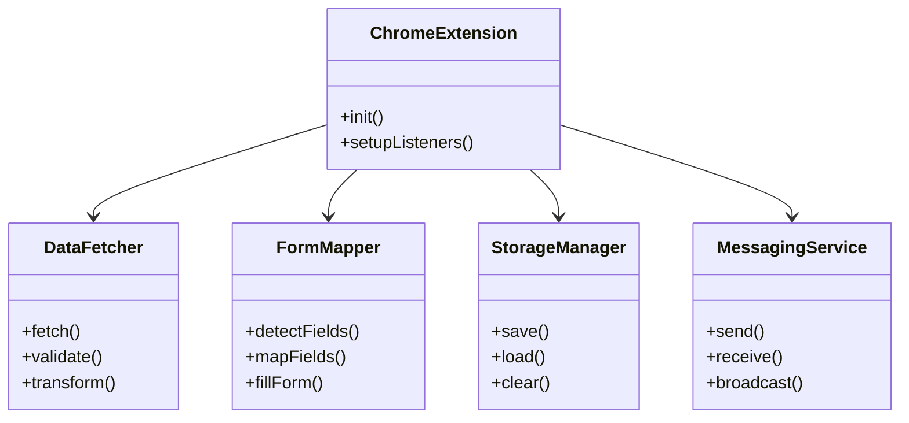

## State Management

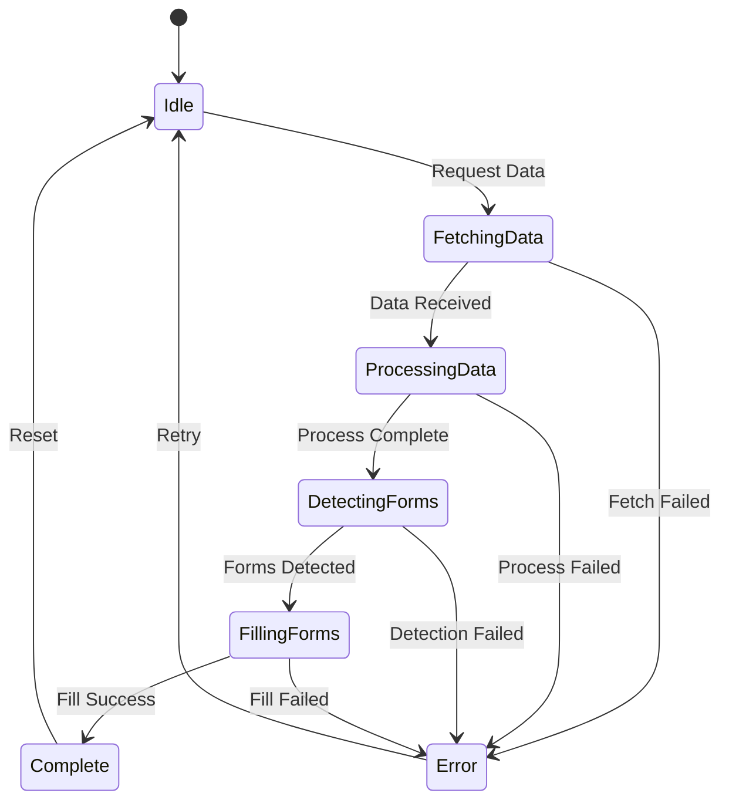

## Data Source Integration

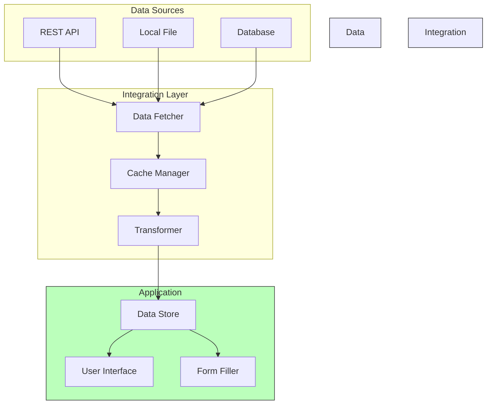

## Security Flow

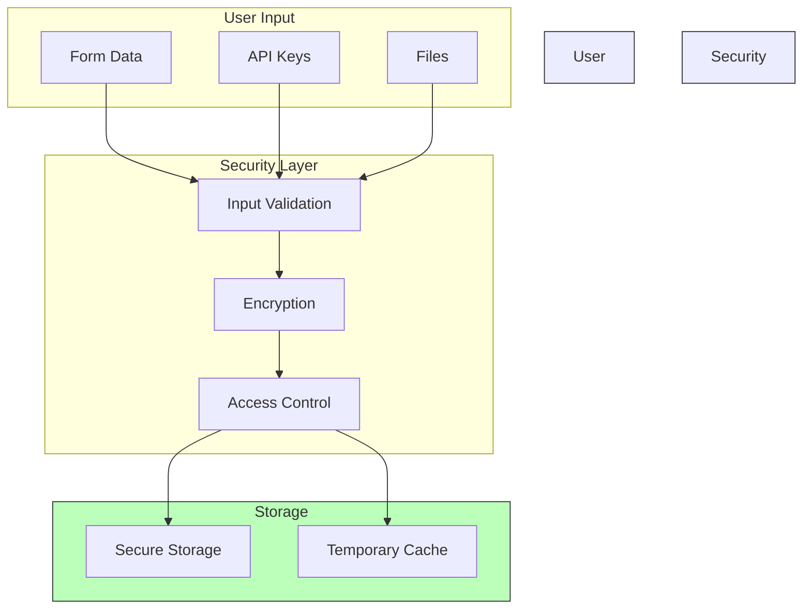

## Performance Optimization

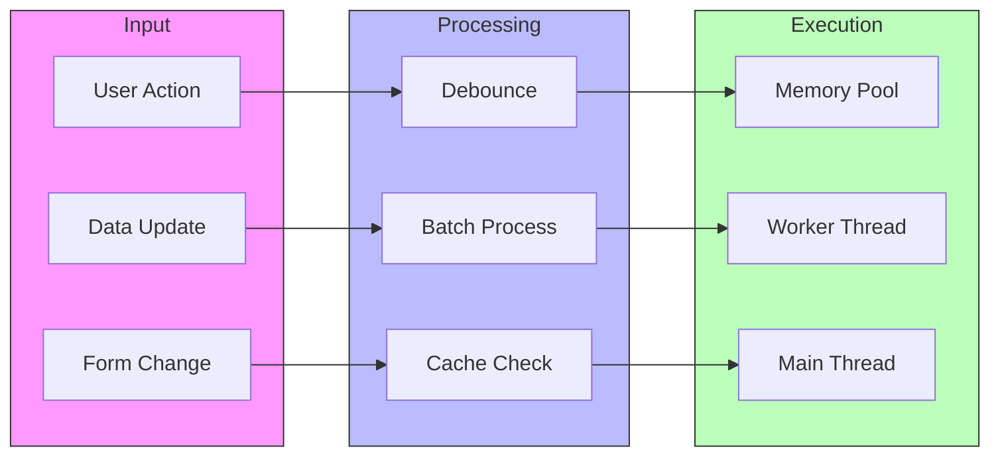

## Error Handling

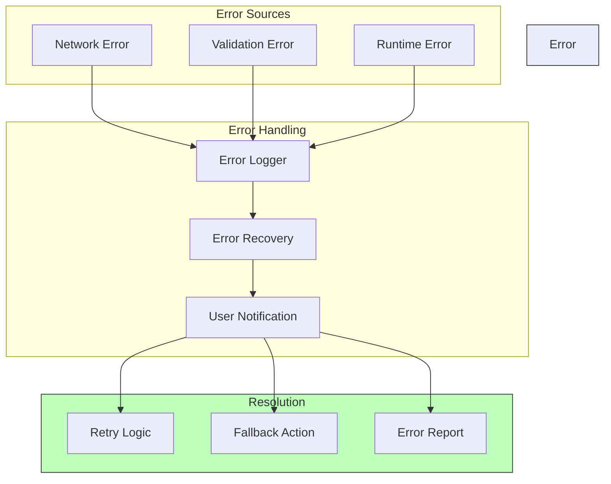

## Testing Strategy

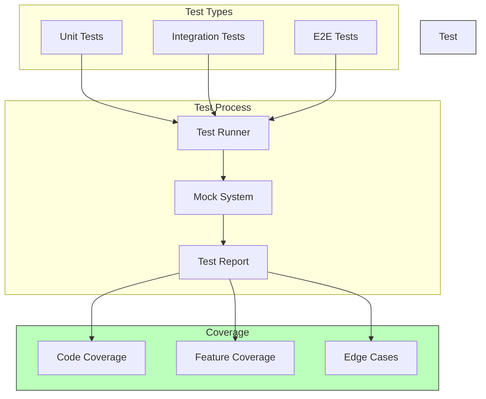

## Deployment Flow

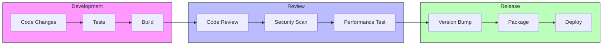

These diagrams provide visual representations of:
1. Overall system architecture
2. Data flow between components
3. Form detection process
4. Component relationships
5. State management
6. Data source integration
7. Security flow
8. Performance optimization
9. Error handling
10. Testing strategy
11. Deployment process

Each diagram is written in Mermaid markdown format, which can be rendered by many markdown viewers and documentation tools. The diagrams help visualize:
- System structure
- Process flows
- Component interactions
- Data movement
- State transitions
- Security measures
- Performance considerations
